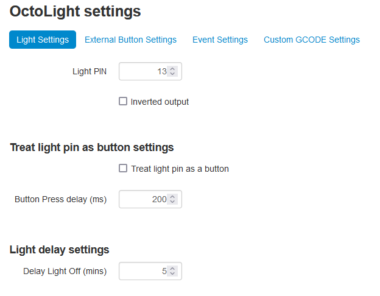
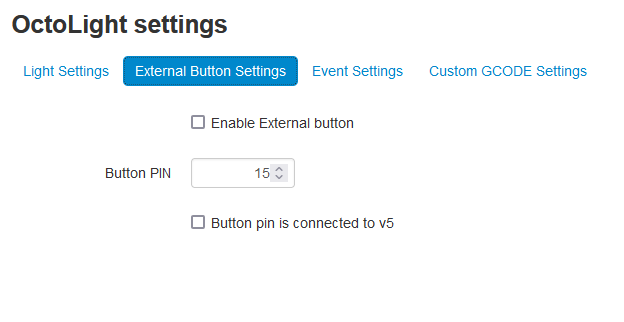
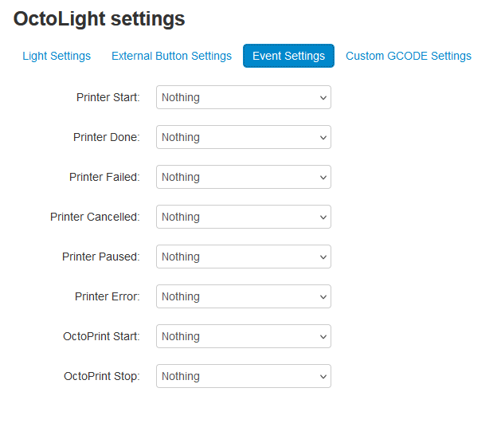
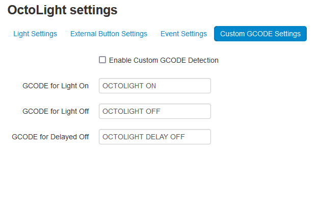

# OctoLight
A simple plugin that allows for the toggling of a GPIO pin on the Raspberry Pi. The user can toggle the pin through a button in the navigation bar, an external button, OctoPrint events and through custom GCODE commands. Printer events also allow the pin to be toggled on then off after a period of time.


## Setup
Install via the bundled [Plugin Manager](https://docs.octoprint.org/en/master/bundledplugins/pluginmanager.html)
or manually using this URL:

	https://github.com/thomst08/OctoLight/archive/master.zip

## Configuration


### Main Light Settings
Currently, you can configure settings:
- `Light PIN`: The pin on the Raspberry Pi that the button controls.
	- Default value: 13
	- The pin number is saved in the **board layout naming** scheme (gray labels on the pinout image below).
	- **!! IMPORTANT !!** The Raspberry Pi can only control the **GPIO** pins (orange labels on the pinout image below)
	- **!! IMPORTANT !!** OctoLight will detect if the GPIO mode is set by another plugin, if not, the GPIO will be set to ``BOARD`` mode, else it will use ``BCM`` mode.  If the GPIO's are in BCM mode, you will need to use the GPIO number instead of the pin number, for example, pin 13 is GPIO 27, so the pin should be set to 27.
	

- `Inverted output`: If true, the output will be inverted.
	- Usage: If you have a light, that is turned off when voltage is applied to the pin (wired in negative logic), you should turn on this option, so the light isn't on when you reboot your Raspberry Pi.

- `Treat light pin as a button`: If true, the output will be treated as a button press.
	- Usage: This function allows OctoLight to toggle the Raspberry Pi pin on and off with a small delay to allow for lights that require a button press to change states.

- `Button Press delay (ms)`: This sets a time out for how long a button press is, this is only used if `Light is a button` is enabled.
	- Default value: 200
	- Note: This value is in micro seconds.

- `Delay Light Off (mins)`: This sets a time out for when the light will automatically turn its self-off in an event.
	- Default value: 5
	- Note: This value is in minutes.

<br />



### External Button Settings

- `Enable External button`: This allows the use of an external button to change the state of the light.
	- This setting is not enabled by default, this setting must be on to use an external button

- `Button PIN`: The pin on the Raspberry Pi used to detect a button press.
	- Default value: 15
	- The pin number is saved in the **board layout naming** scheme (gray labels on the pinout image).
	- **!! IMPORTANT !!** The Raspberry Pi can only control the **GPIO** pins (orange labels on the pinout image)
	- **!! IMPORTANT !!** OctoLight will detect if the GPIO mode is set by another plugin, if not, the GPIO will be set to ``BOARD`` mode, else it will use ``BCM`` mode.  If the GPIO's are in BCM mode, you will need to use the GPIO number instead of the pin number, for example, pin 15 is GPIO 22, so the pin should be set to 22.

- `Button pin is connected to v5`: This sets the button pin to detect when the pin receives a current
	- The default is disabled
	- If you button pin is connected to a button that is connected to a ground pin, this setting should be disabled.  However, if you connect the button to a v5 pin, this setting must be enabled.

<br />



### Event Settings

- `Setup Printer and OctoPrint Events`: This allows you to select what you would like the light to do on a printer event.
	- There are multiple events, these can each be tweaked based on your desired preference.
	- Default is set to 'Nothing'.
	- Set the light to do nothing, turn on, turn off, or turn on then turn itself off after the delay time value.

<br />



### Custom GCODE Settings

- `Enable Custom GCODE Detection`: This must be enabled for GCODE to be read and toggle the light.
	- If this option is disabled, then the custom GCODE bellow this option will not function.

- `Setup Custom GCODE`: This allows you to select what you would like the light to do when a set GCODE command is sent to the printer.
	- Default is 'OCTOLIGHT ON', 'OCTOLIGHT OFF' and 'OCTOLIGHT DELAY OFF' for on, off and on with a delayed turn off respectively.
	- These commands can be any command the user enters, these could be event commands for the printer (e.g.: M600) or custom commands.


## API

**Note:** As of version 1.0.1, the API has been updated to be more in line with a RESTFUL standard, instead of functions being changed with a ``GET`` request, the new setup requires a ``POST`` request and the command to be sent in the body.  To keep backwards compatibility with previous API calls, the previous ``GET`` commands can still be used, however, it is recommended to update as these commands will be removed around the end of 2024.  Please reach out if this is an issue or if you need help.  Please have a look at the new API calls below to update.

Base API URL: `http://YOUR_OCTOPRINT_SERVER/api/plugin/octolight`

This API returns light state in JSON for both ``GET`` and ``POST`` requests: ``{state: true}`` <br />
- ``GET`` calls will require a API key with the "STATUS" permission.  Without this, you will receive a 403 error. <br />
- ``POST`` calls will require a API key with the "CONTROL" permission.  Without this, you will receive a 403 error.

#### Actions
- **toggle**: Toggle light switch on/off.
- **turnOn**: Turn on light.
- **turnOff**: Turn off light.
- **delayOff**: Turn on light and setup timer to shutoff light after delay time, note, `{ "delay": VALUE }` can be added to the body to override the default delay time.
- **delayOffStop**: Shuts off timer and light.

#### Examples

##### GET Request
- Check the light status: `curl -H "Content-Type: application/json" -H "X-Api-Key: YOUR_OCTOPRINT_API_KEY" -X GET http://YOUR_OCTOPRINT_SERVER/api/plugin/octolight`

##### POST Requests
- Toggle light: `curl -H "Content-Type: application/json" -H "X-Api-Key: YOUR_OCTOPRINT_API_KEY" -X POST -d '{"command": "toggle"}' http://YOUR_OCTOPRINT_SERVER/api/plugin/octolight`
- Turn light on: `curl -H "Content-Type: application/json" -H "X-Api-Key: YOUR_OCTOPRINT_API_KEY" -X POST -d '{"command": "turnOn"}' http://YOUR_OCTOPRINT_SERVER/api/plugin/octolight`
- Turn light off: `curl -H "Content-Type: application/json" -H "X-Api-Key: YOUR_OCTOPRINT_API_KEY" -X POST -d '{"command": "turnOff"}' http://YOUR_OCTOPRINT_SERVER/api/plugin/octolight`
- Delay off with default value: `curl -H "Content-Type: application/json" -H "X-Api-Key: YOUR_OCTOPRINT_API_KEY" -X POST -d '{"command": "delayOff"}' http://YOUR_OCTOPRINT_SERVER/api/plugin/octolight`
- Delay off after 3 min: `curl -H "Content-Type: application/json" -H "X-Api-Key: YOUR_OCTOPRINT_API_KEY" -X POST -d '{"command": "delayOff", "delay": 3}' http://YOUR_OCTOPRINT_SERVER/api/plugin/octolight`
- Delay off stop: `curl -H "Content-Type: application/json" -H "X-Api-Key: YOUR_OCTOPRINT_API_KEY" -X POST -d '{"command": "delayOffStop"}' http://YOUR_OCTOPRINT_SERVER/api/plugin/octolight`


## Issue installing or using the button function
Past versions of OctoLight heavily relied on the plugin `RPi.GPIO`, this plugin is becoming EOL and doesn't work well with Linux kernel 6.6.0+.  Specifically, it works, however, it cannot attach button functions to GPIO state changes.
This means OctoLight (as of version 1.0.2), has switched to using `gpiozero` as its main package, this is a wrapper for `RPi.GPIO` and `lgpio`, allowing it to choose what is best for the system.  With the new version of OctoLight, it will try to install `lgpio` if your Python version supports it, but can fall back to `RPi.GPIO` if it does not.  If you have issues with using/installing this plugin, please make sure you have the latest version of OctoPi install (you might need to do a freash install) or reach out for help.

If you are running the latest version of OctoPi (1.1.0 as of the time of writing), you might find that trying to use the button feature of this plugin causes a crash. Checking the error log, you might find the following error.
```
GPIO.add_event_detect(
	RuntimeError: Failed to add edge detection
```
This is an issue caused by `RPi.GPIO` and why the plugin needs to switch. `lgpio` will solve this issue, but you might need to tweak the system to correct this issue. This can be done in two ways.
- Format the system and install a nightly build of OctoPi.  The new nightly builds have a fix for this but it is not yet in the latest stable build.
- Manually correct the system. This is done with the following.  This is the fix that is introduced in the nightly builds.
	1. SSH into your OctoPi, (This can be different on each platform, but the command generally is ``ssh pi@{ip of pi}``, password by default is ``raspberry``)
	2. Run the following command ``sudo nano /etc/systemd/system/octoprint.service``
	3. Add the following to the file under ``[Service]`` section of the file.

	```
	Environment="LG_WD=/tmp"
	```

	The file should look something like this...
	```
	[Unit]
	Description=The snappy web interface for your 3D printer
	After=network.online.target
	Wants=network.online.target

	[Service]
	Environment="HOST=127.0.0.1"
	Environment="PORT=5000"
	Environment="REQUESTS_CA_BUNDLE=/etc/ssl/certs/ca-certificates.crt"
	Environment="LG_WD=/tmp"
	Type=simple
	User=1000
	ExecStart=/opt/octopi/oprint/bin/octoprint serve --host=${HOST} --port=${PORT}

	[Install]
	WantedBy=multi-user.target
	```

	4. Once done, hold down control and press x
	5. Y to save and press enter than enter again.
	6. From this point, you are done, but type ``sudo reboot`` and this will restart the Pi

Either of these methods should correct the issue. If not, try uninstalling the plugin and reinstalling OctoLight after trying these fixes, please reach out if you need help beyond this.  Older systems might have more issues going forward, doing a freash install could help prevent issues in the future.

### Other steps

When installing other plugins, a plugin can force a specific version of a library to be installed.  This can cause issues with OctoLight.
In order to check for issues, you can query the list of libraries installed using the following command.  Note: You will need to SSH into OctoPrint Server to check.
```
./oprint/bin/pip list
```
This will print out all the libraries installed, check that gpiozero and lgpio are on the latest version in order to avoid conflicts.  You can force the plugins to update with the following commands. Note: This can cause issues with other plugins, so note what plugins you have and their versions before making changes.

```
./oprint/bin/pip install --upgrade --force-reinstall --no-cache-dir gpiozero
./oprint/bin/pip install --upgrade --force-reinstall --no-cache-dir lgpio
```

If you need to install a specific version of a library, you can do it with the following command.
```
./oprint/bin/pip install --upgrade --force-reinstall --no-cache-dir packagename==1.2.3
```

Always reboot the system or OctoPrint to make sure the libraries are reloaded.  This can be done with `sudo reboot`


## Thank you list
Thank you goes out to the following people:
- [@gigibu5]( https://github.com/gigibu5 ) - Creator of Octolight
